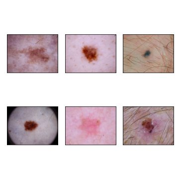
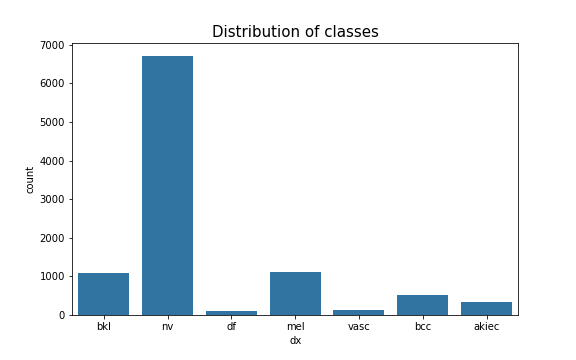
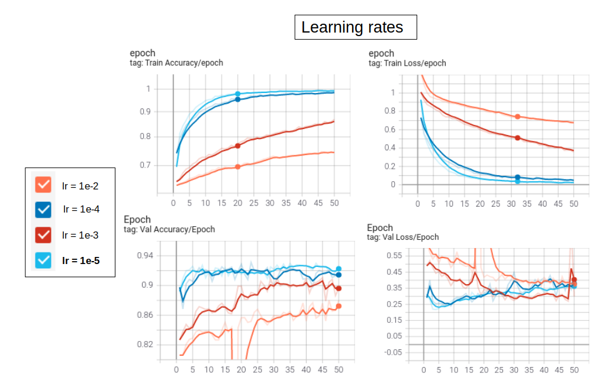
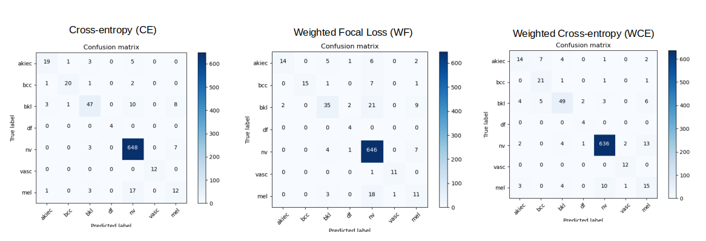

# Skin Lesion Classification using Deep Learning with Pytorch

Personal project for analysing, processing and classifying skin lesion images
from Kaggle Skin Cancer MNIST dataset using Transfer Learning in Pytorch.

## Overview
HAM10000 ("Human Against Machine with 10000 training images") dataset consists of
dermatoscopic images from different populations.

The final dataset consists of 10015 dermatoscopic images which can serve as a training set 
for academic machine learning purposes. Cases include a representative collection of all 
important diagnostic categories of pigmented lesions: Actinic keratoses and 
intraepithelial carcinoma / Bowen's disease (akiec), basal cell carcinoma (bcc), benign 
keratosis-like lesions (bkl), dermatofibroma (df), melanoma (mel), melanocytic nevi (nv) and 
vascular lesions (vasc).

More than 50% of lesions are confirmed through histopathology (histo), the ground truth for the
rest of the cases is either follow-up examination (follow_up), expert consensus (consensus), 
or confirmation by in-vivo confocal microscopy (confocal). 
The dataset includes lesions with multiple images, which can be tracked by the lesion_id-column within the HAM10000_metadata
file.

I have used resnext101_32x8d with pretrained weights for training and classification.


## Table of Contents

- [Installation](#installation)  
- [Usage](#usage)  
- [Data](#dataset)    
- [Training and Results](#training-and-results)    
- [License](#license)
- [Acknowledgements](#acknowledgements)     
- [Footer](#footer)
      
### Installation
Clone project:
```
git clone https://github.com/Nishita-Kapoor/skin_cancer.git
```
Once cloned, install packages:
```
pip install -r requirements.txt
```
### Usage
To train the model, run:
```python main.py --train=True``` 

Other optional arguments:

|   argument    |  type    | default  |            description                          |
| ------------- |:--------:|:--------:| -----------------------------------------------:|
|  --view_data  |   bool   |    False |          see sample images                      |
|  --num_epochs |   int    |    50    |            num of epochs                        |
|  --test       |   bool   |   True   |            test the model                       |
|  --gpus       |   str    |    0     |           which gpu to use                      |
|  --path       |   str    |  {path}  |           path of dataset                       |
|  --version    |   str    |    0     |            run versions                         |
|  --batch_size |   int    |    32    |             batch size                          |
|  --lr         |   float  |    1e-5  |           learning rate                         |
|  --image_path |   str    |  {path}  | path for single image prediction (inference)    |
|  --loss       |   str    |    ce    | choose loss between 'ce', 'focal', 'weighted_ce'|            |


I also used Google Colab for trainings as per this
[article](https://towardsdatascience.com/google-drive-google-colab-github-dont-just-read-do-it-5554d5824228).
To train model using Colab, the notebook in this repo ```skin_cancer_colab.ipynb``` can be followed.

### Dataset
Dataset Name: Skin Cancer MNIST: HAM10000 

Link: [Kaggle Skin Cancer MNIST: HAM10000 dataset](https://www.kaggle.com/kmader/skin-cancer-mnist-ham10000)

The dataset is organized into folders containing the lesion images and a 'HAM10000_metadata.csv'
file which has information such as image_id, age, lesion type, etc.

```
Kaggle Dataset:
Number of Class         : 7
Number/Size of Images   : 10015 (2.9GB)
```

The information in the ```HAM10000_metadata.csv``` was explored in the ```EDA.ipynb``` notebook of this repo, including
sample images visualizations, data explorations and splitting dataset into training, validation and test sets.

```
Modified Dataset:
Number of Class         : 7
Number/Size of Images   : Total      : 10015 
                          Training set   : 8360 
                          Validation set : 827 
                          Test set       : 828  
```
#### Sample Input Images:



The images can be assigned to 7 classes as follows:

|  Class label  |  Class description                   | 
| ------------- |:------------------------------------:| 
|       0       |  Actinic keratoses (akiec)           |   
|       1       |  Basal cell carcinoma (bcc)          | 
|       2       |  Benign keratosis-like lesions (bkl) | 
|       3       |  Dermatofibroma (df)                 | 
|       4       |  Melanocytic nevi(nv)                | 
|       5       |  Vascular lesions (vasc)             | 
|       6       |  Melanoma (mel)                      | 

The dataset is quite imbalanced w.r.t the classes.



### Training and Results: 

A bunch of trainings were performed with following parameters, in order to compare and select best model performance.
- model: ``` resnext101_32x8d ``` with pretrained weights
- epochs: 50
- batch size: 32

Training and validation curves were visualized on Tensorboard and Classification reports were evaluated
for the test set.

#### Experiment 1: Learning rates
Multiple learning rates were experimented with and following accuracy and loss curves were
visualized for training and val set.



The lower the learning rate, better the performance. Hence a **learning rate of 0.00001 (1e-5)** was fixed for 
further trainings.

#### Experiment 2: Cross Entropy (CE) vs Weighted Cross Entropy (WCE) vs Weighted Focal loss (WF)
- Since the dataset is quite imbalanced in the 7 classes, weighted loss functions (Weighted Cross Entropy
and Weighted Focal Loss) were evaluated against baseline of Cross Entropy loss.
- Weights used were corresponding to the class distribution in the training set.
- Focal loss was implemented with Gamma =2. Other values can be compared in further experiments.
- Because of the imbalanced class, accuracy cannot be the best evaluation metric. Hence Test set results were
also compared on metrics like average precision, average recall and average F1 scores. Confusion matrices were also plotted.
  
|                 |Accuracy (%)| Precision| Recall | F1 Score |
| --------------- |:----------:|:--------:|:------:|---------:|
|        CE       |     92     |   0.84   |  0.79  |  0.81    |
|  Weighted Focal |     88     |   0.75   |  0.69  |  0.69    |
|   Weighted CE   |     90     |   0.68   |  0.78  |  0.72    |




#### Conclusion:
- Adding weights to the loss doesn't seem to have any significant improvement on performance.
  Further values of gamma for Focal loss can be explored.
- Decreasing learning rate has quite an effect on training and val accuracies.
- Overall, best F1 score obtained was of 0.81 with the ``` resnext101_32x8d ``` trained over 50 epochs
  with a learning rate of 0.00001. 

### License
Please see [LICENSE](./LICENSE)
    
### Acknowledgements
The project is intended purely as a learning experience. The framework was built based on the
[here](https://github.com/musicmilif/ham10000) and
[here](https://github.com/ishanrai05/skin-cancer-prediction).

### Footer
Please feel free to contribute/use the repo as per need. In case of any questions,
you can reach me at <nishita.s66@gmail.com>.